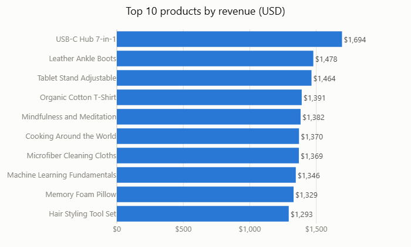
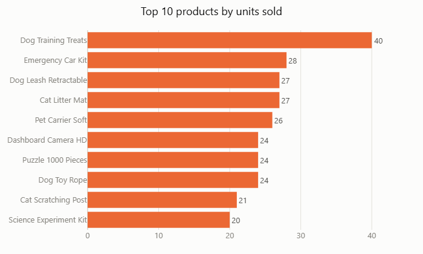
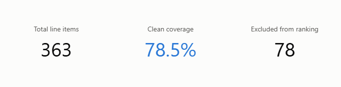
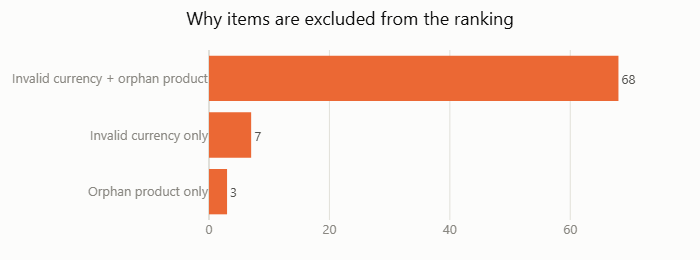
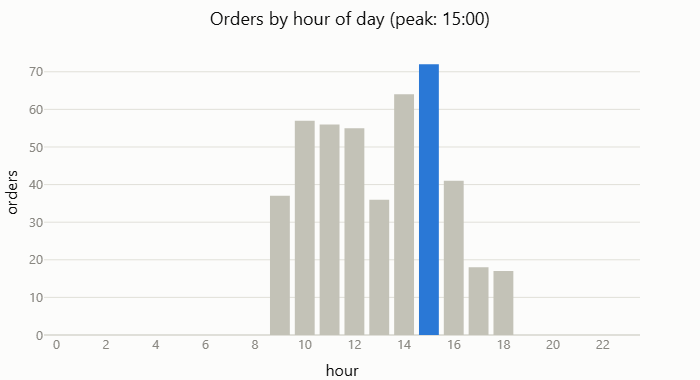
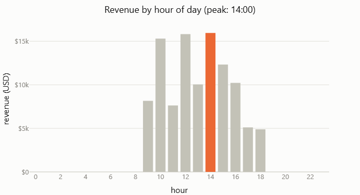
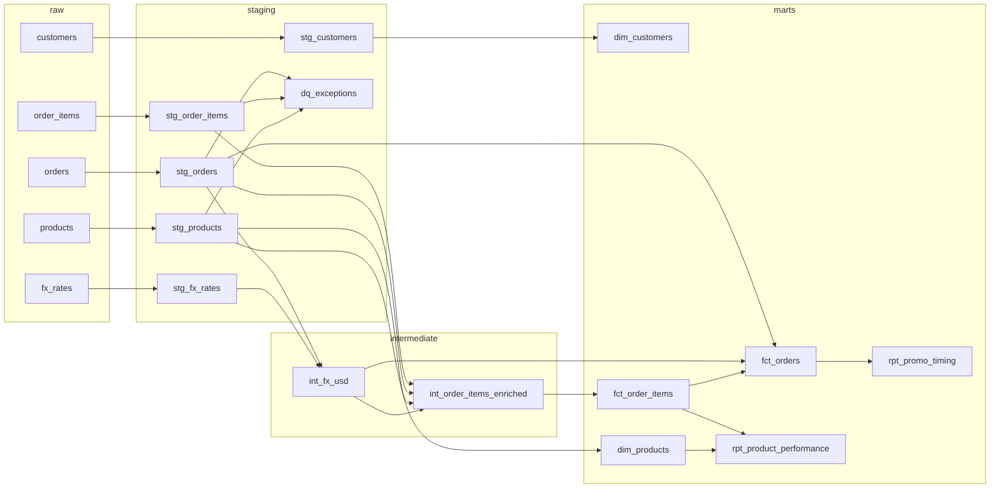

# eCommerce analytics pipeline

Raw CSV/JSON sales data, ingested into DuckDB and modeled with dbt into a small star
schema, answering two business questions: top-performing products, and the best time
of day to run a promotion.

See `design_notes.md` for the architecture rationale, the data-quality findings, and
what would change for a production version.

## Business answers

**Which products are the top performers?**

By revenue, USB-C Hub 7-in-1 leads ($1,694), followed by Leather Ankle Boots and Tablet
Stand Adjustable. By units sold, a different product leads: Dog Training Treats, at 40
units. Revenue and volume disagree because they measure different things: a cheaper
product can move more units without leading in dollars.

Both rankings only count real products (the "Unknown" bucket, for line items whose
`product_id` has no catalog match, is excluded from the ranking itself and reported
separately). Revenue additionally requires a convertible currency; volume does not,
since units sold has nothing to do with currency. See `rpt_product_performance` and
the coverage panel below for the exact counts.

 

 

**What is the best time of day for a promotion?**

Orders only happen between 9:00 and 18:00: there is no activity outside that window.
Order count peaks at 15:00 (72 orders), but revenue peaks at 14:00 (about $15.9k). The
busiest hour is not the most profitable one, so the answer depends on the goal: 15:00
for reach, 14:00 for revenue.

 

Full notebook with the code behind every chart: `notebooks/02_business_answers.ipynb`.

## Setup

```powershell
python -m venv .venv
.venv\Scripts\pip install -r requirements.txt
```

`data/raw/*` (the five source files) is not tracked in this repo; place them there
before running anything below.

## Run

```powershell
.venv\Scripts\python.exe ingest.py
.venv\Scripts\dbt.exe build --profiles-dir .
```

`ingest.py` is idempotent: running it again just re-reads `data/raw/*` into the
`raw` schema. `dbt build` runs every model and every test.

## Explore

```powershell
.venv\Scripts\dbt.exe docs generate --profiles-dir .
.venv\Scripts\dbt.exe docs serve --profiles-dir .
```

Opens a browser with the model lineage graph and the column-level catalog.

To query the warehouse directly:

```python
import duckdb
con = duckdb.connect('warehouse.duckdb', read_only=True)
con.sql("select * from main.rpt_product_performance order by total_revenue_usd desc limit 10").show()
```

## Structure

```
ingest.py                    loads data/raw/* into raw.* (idempotent, full refresh)
models/staging/               typed, renamed, flagged 1:1 with each source
models/intermediate/          currency conversion, order-item enrichment
models/marts/                 facts, dimensions, and the two business-question marts
tests/                        custom data tests
notebooks/01_eda.ipynb         exploratory analysis of the raw sources
notebooks/02_business_answers.ipynb   charts answering the two business questions
design_notes.md               architecture rationale and data-quality findings
```

## Lineage



Custom data tests are not shown as nodes above.
Each one is tied to the model it tests:

| Model | Assertion | What it checks |
|---|---|---|
| `dq_exceptions` | `assert_dq_exceptions_no_duplicate_reason` | No duplicate `(source_table, record_id, dq_reason)` row |
| `int_fx_usd` | `assert_int_fx_usd_no_duplicate_date_currency` | No duplicate `(rate_date, currency)` row |
| `int_fx_usd` | `assert_int_fx_usd_gbp_2024_09_15_inverted` | GBP on 2024-09-15 resolves through inversion, the one date with no direct GBP rate |
| `int_order_items_enriched` | `assert_int_order_items_enriched_null_revenue_count` | `revenue_usd` is null on exactly the 75 rows with an unconvertible currency |
| `int_order_items_enriched` | `assert_int_order_items_enriched_currency_mismatch_orders` | Header currency and item currency disagree on exactly 114 orders |
| `fct_orders` | `assert_fct_orders_item_count_matches_fct_order_items` | Sum of `item_count` across orders equals the row count of `fct_order_items` |
